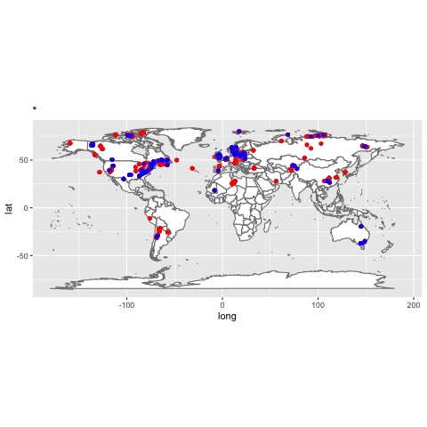

# Introduction
Taxonomy is the method by which organisms are assigned to a genus and species group. It is a science that is constantly evolving due to our growing knowledge of a group of organisms. This is especially true of graptolite taxonomy. Early work with graptolites focused solely on naming graptolites for use in biostratigraphy, meaning that graptolites were loosely grouped based on their general appearance instead of evolutionary or trait based backing. As studies into the evolution in graptolite morphology, or genetics based traits increased, there was an increasing realization that synonymies, or the same type of organism with different taxonomic names, existed. Through carefully examination of graptolite literature these synonyms are slowly being identified (Mitchell et. al, unpublished data). However, the presence of synonyms may not only be due to changes in graptolite research through time. These synonyms may be geographically located either due to a cultural preference for generating new species or a tectonically strained region where morphology is more difficult to constrain. It may also be that particular authors were more likely to generate new species names due to a variety of factors. 

This research will attempt to examine any correlation by first mapping the presence of graptolites that both with and without synonyms on a world map to visually determine locations with more synonymies. This map will then be animated such that the graptolite locations will plot based upon the year that they were named. If there is a temporal correlation to synonymies, more synonyms should plot within a given time frame than others. Finally, the graptolites with synonyms will be grouped by the original naming author with the number of individual species summed per author to determine if there is an author based correlation.


# Materials and methods

The presence of graptolite synonymies may be correlated to a number of factors including time, cultural or tectonic location, and author. The project will combine data on synonymies, contained within the Taxonomic Dictionary (Mitchell et. al., unpublished data), with graptolite locatlity information, complied as section data (Mitchell et. al., unpublished data). This will be used to:

1. Examine geographic distribution of graptolites with synonymies compared to graptolites without synonymies
2. Examine temporal distribution of graptolite synonymies
3. Determine the number of synonymies based on naming author
4. Determine number of synonymies per author per year.

Intially, the required packages will need to be loaded (you may need to install some packages):

```{r, message=F, warning=F}
library(dplyr)
library(tidyr)
library(sp)
library(rgeos)
library(maptools)
library(ggplot2)
library(ggmap)
library(maptools)
library(maps)
library(leaflet)
library(htmlwidgets)
library(widgetframe)
library(DT)
library(devtools)
library(RCurl)
library(httr)
library(gganimate)
```

The data is contained in two comma separated files (CSV), the Taxonomic Dictionary and the section data.
```{r}
#Load Taxonomic Dictionary

myDict=read.csv("data/Taxonomic dictionary Oct3'17_mod.csv",header=T,sep=",")

#Load section data

mySect=read.csv("data/sections_table format.csv", header=T, sep =",")
```

## Geographic Methodology

After loading both CSV files, the section data and the Taxonomic Dictionary must be joined so that all the geographic locations are paired with the correct taxonomic information including the presence of senior synonyms. This data is then filtered by the senior synonym column in order to generate a list that contains only graptolite locations with named senior synonyms.
```{r}
#Join the sections data and the graptolite dictionary
Grap_locate=full_join(mySect,myDict,by="GRCode")

#Generate synonoym list
synGrap_locate=filter(Grap_locate, senior.synonym!="*" & senior.synonym!=99999)
```

These two data sets are then visually compared by overlapping the synonyms list over all of the graptolite locations on a world map.
```{r, fig.width=6, fig.height=3, fig.cap="Map illustrating graptolite locations",eval=FALSE}
Grap_map_inter=leaflet() %>% 
  addTiles() %>% 
  addCircles(data=Grap_locate,group="All Graptolite Locations",color="red") %>% 
  addCircles(data=synGrap_locate,group="Graptolite Synonym Locations",color="blue") %>% 
  addLayersControl(overlayGroups=c("All Graptolite Locations","Graptolite Synonym Locations"), options=layersControlOptions(collapsed=F))
frameWidget(Grap_map_inter,height = 500)
```

The synonymies are then filtered by the decade in which they were named, beginning in 1828 with the first named species.
```{r}
# Filter by "decade"
synGrap_year=filter(synGrap_locate, date!="*" & date!="Chen et al 2011" & date!="1997a")

synGrap_18_2837=filter(synGrap_year, date==1828 | date==1829 | date==1830 | date==1831 | date==1832 | date==1833 | date==1834 | date==1835 | date==1836 | date==1837)
synGrap_18_3847=filter(synGrap_year, date==1838 | date==1839 | date==1840 | date==1841 | date==1842 | date==1843 | date==1844 | date==1845 | date==1846 | date==1847)
synGrap_18_4857=filter(synGrap_year, date==1848 | date==1849 | date==1850 | date==1851 | date==1852 | date==1853 | date==1854 | date==1855 | date==1856 | date==1857)
synGrap_18_5867=filter(synGrap_year, date==1858 | date==1859 | date==1860 | date==1861 | date==1862 | date==1863 | date==1864 | date==1865 | date==1866 | date==1867)
synGrap_18_6877=filter(synGrap_year, date==1868 | date==1869 | date==1870 | date==1871 | date==1872 | date==1873 | date==1874 | date==1875 | date==1876 | date==1877)
synGrap_18_7887=filter(synGrap_year, date==1878 | date==1879 | date==1880 | date==1881 | date==1882 | date==1883 | date==1884 | date==1885 | date==1886 | date==1887)
synGrap_18_8897=filter(synGrap_year, date==1888 | date==1889 | date==1890 | date==1891 | date==1892 | date==1893 | date==1894 | date==1895 | date==1896 | date==1897)
synGrap_1819_9807=filter(synGrap_year, date==1898 | date==1899 | date==1900 | date==1901 | date==1902 | date==1903 | date==1904 | date==1905 | date==1906 | date==1907)
synGrap_19_0817=filter(synGrap_year, date==1908 | date==1909 | date==1910 | date==1911 | date==1912 | date==1913 | date==1914 | date==1915 | date==1916 | date==1917)
synGrap_19_1827=filter(synGrap_year, date==1918 | date==1919 | date==1920 | date==1921 | date==1922 | date==1923 | date==1924 | date==1925 | date==1926 | date==1927)
synGrap_19_2837=filter(synGrap_year, date==1928 | date==1929 | date==1930 | date==1931 | date==1932 | date==1933 | date==1934 | date==1935 | date==1936 | date==1937)
synGrap_19_3847=filter(synGrap_year, date==1938 | date==1939 | date==1940 | date==1941 | date==1942 | date==1943 | date==1944 | date==1945 | date==1946 | date==1947)
synGrap_19_4857=filter(synGrap_year, date==1948 | date==1949 | date==1950 | date==1951 | date==1952 | date==1953 | date==1954 | date==1955 | date==1956 | date==1957)
synGrap_19_5867=filter(synGrap_year, date==1958 | date==1959 | date==1960 | date==1961 | date==1962 | date==1963 | date==1964 | date==1965 | date==1966 | date==1967)
synGrap_19_6877=filter(synGrap_year, date==1968 | date==1969 | date==1970 | date==1971 | date==1972 | date==1973 | date==1974 | date==1975 | date==1976 | date==1977)
synGrap_19_7887=filter(synGrap_year, date==1978 | date==1979 | date==1980 | date==1981 | date==1982 | date==1983 | date==1984 | date==1985 | date==1986 | date==1987)
synGrap_19_8897=filter(synGrap_year, date==1988 | date==1989 | date==1990 | date==1991 | date==1992 | date==1993 | date==1994 | date==1995 | date==1996 | date==1997)
synGrap_1920_9807=filter(synGrap_year, date==1998 | date==1999 | date==2000 | date==2001 | date==2002 | date==2003 | date==2004 | date==2005 | date==2006 | date==2007)
synGrap_20_0817=filter(synGrap_year, date==2008 | date==2009 | date==2010 | date==2011 | date==2012 | date==2013 | date==2014 | date==2015 | date==2016 | date==2017)
```

These subdivisions are then mapped on a world map as individual layers to indicate if there is a geographic relation with the above decadal time breaks.
```{r, fig.width=6, fig.height=3, fig.cap="Map of graptolite locations grouped by decade", eval=FALSE}
Grap_decade_inter=leaflet() %>% 
  addTiles() %>% 
  addCircles(data=Grap_locate,group="All Graptolite Locations",color="red") %>% 
  addCircles(data=synGrap_18_2837,group="Graptolite Synonymies 1828-1837",color="blue") %>%
  addCircles(data=synGrap_18_3847,group="Graptolite Synonymies 1838-1847",color="blue") %>%
  addCircles(data=synGrap_18_4857,group="Graptolite Synonymies 1848-1857",color="blue") %>%
  addCircles(data=synGrap_18_5867,group="Graptolite Synonymies 1858-1867",color="blue") %>%
  addCircles(data=synGrap_18_6877,group="Graptolite Synonymies 1868-1877",color="blue") %>%
  addCircles(data=synGrap_18_7887,group="Graptolite Synonymies 1878-1887",color="blue") %>%
  addCircles(data=synGrap_18_8897,group="Graptolite Synonymies 1888-1897",color="blue") %>%
  addCircles(data=synGrap_1819_9807,group="Graptolite Synonymies 1898-1907",color="blue") %>%
  addCircles(data=synGrap_19_0817,group="Graptolite Synonymies 1908-1917",color="blue") %>%
  addCircles(data=synGrap_19_1827,group="Graptolite Synonymies 1918-1927",color="blue") %>%
  addCircles(data=synGrap_19_2837,group="Graptolite Synonymies 1928-1937",color="blue") %>%
  addCircles(data=synGrap_19_3847,group="Graptolite Synonymies 1938-1947",color="blue") %>%
  addCircles(data=synGrap_19_4857,group="Graptolite Synonymies 1948-1957",color="blue") %>%
  addCircles(data=synGrap_19_5867,group="Graptolite Synonymies 1958-1967",color="blue") %>%
  addCircles(data=synGrap_19_6877,group="Graptolite Synonymies 1968-1977",color="blue") %>%
  addCircles(data=synGrap_19_7887,group="Graptolite Synonymies 1978-1987",color="blue") %>%
  addCircles(data=synGrap_19_8897,group="Graptolite Synonymies 1988-1997",color="blue") %>%
  addCircles(data=synGrap_1920_9807,group="Graptolite Synonymies 1998-2007",color="blue") %>%
  addCircles(data=synGrap_20_0817,group="Graptolite Synonymies 2008-2011",color="blue") %>%
  addLayersControl(overlayGroups=c("All Graptolite Locations","Graptolite Synonymies 1828-1837","Graptolite Synonymies 1838-1847",
                                   "Graptolite Synonymies 1848-1857","Graptolite Synonymies 1858-1867","Graptolite Synonymies 1868-1877",
                                   "Graptolite Synonymies 1878-1887","Graptolite Synonymies 1888-1897","Graptolite Synonymies 1898-1907",
                                   "Graptolite Synonymies 1908-1917","Graptolite Synonymies 1918-1927","Graptolite Synonymies 1928-1937",
                                   "Graptolite Synonymies 1938-1947","Graptolite Synonymies 1948-1957","Graptolite Synonymies 1958-1967",
                                   "Graptolite Synonymies 1968-1977","Graptolite Synonymies 1978-1987","Graptolite Synonymies 1988-1997",
                                   "Graptolite Synonymies 1998-2007","Graptolite Synonymies 2008-2011"),
                   options=layersControlOptions(collapsed=F))
frameWidget(Grap_decade_inter,height = 500)
```

However, there is more variation in the number and locations of synonymies by year that is being time averaged on the decade scale. This differentiation is displayed using an animation.
```{r, eval=FALSE}
worldmap=borders("world",colour="gray50",fill="white")
mapWorld=ggplot()+worldmap

Grap_map=
  mapWorld+
  geom_point(data=Grap_locate,aes(x=Longitude,y=Latitude),col="red")+
  geom_point(data=synGrap_locate,aes(x=Longitude,y=Latitude,frame=date),col="blue")+
  coord_equal()

gganimate(Grap_map,interval=3.5)
#interval is in seconds
```

## Temporal and Authorial Analysis Methodology

In order to observe any correlation between the number of graptolite synonymies and temporal factors or the naming author, the data from the Taxonomic Dictionary is first filtered and then the number of instances per year or author are counted. These are displayed in interactive tables.
```{r,eval=FALSE}
synGrap=filter(myDict, senior.synonym!="*" & senior.synonym!=99999 & senior.synonym!=9999)

#number of synonymies by year
synGrap_yearcount=
  synGrap %>% 
  filter(date!="*" & date!="Chen et al 2011" & date!="1997a") %>% 
  group_by(date) %>% 
  summarise(n=n())
##1226 in 145 years
datatable(synGrap_yearcount,options = list(pageLength=10))

#number of synonymies by author
synGrap_authorcount=
  synGrap %>% 
  group_by(taxon_author) %>% 
  summarise(n=n())
##1592 for 423 authors
datatable(synGrap_authorcount,options=list(pageLength=10))
```

Observation of the number of synonymies per author led to the question if there is a correlation of the number of synonymies per author per year.
```{r,eval=FALSE}
#group by author, year
synGrap_authoryear=
  synGrap %>% 
  group_by(taxon_author,date) %>% 
  summarise(n=n())
#1592 for 733 author/year combos
datatable(synGrap_authoryear,options=list(pageLength=10))
```

These three analyses are statistically tested for significance by applying two chi-squared tests. The first tests the null hypothesis that there is a random distribution of graptolites with synonymies within the categories. This is accomplished with a Monte Carlo simulation utilizing 1000 replicates. The second tests the null hypothesis that there is a uniform distribution of graptolites with synonymies (observed=expected).
```{r, eval=FALSE}
chisq.test(synGrap_yearcount$n,,simulate.p.value = T,B=1000)

synGrap_year_expct=mutate(synGrap_yearcount,expected=rep(9,length(synGrap_yearcount$n)))
chisq.test(rbind(synGrap_year_expct$n,synGrap_year_expct$expected))  

# Per author
chisq.test(synGrap_authorcount$n,,simulate.p.value = T,B=1000)

synGrap_author_expect=mutate(synGrap_authorcount,expected=rep(4,length(synGrap_authorcount$n)))
chisq.test(rbind(synGrap_author_expect$n,synGrap_author_expect$expected))

# Per author per year
chisq.test(synGrap_authoryear$n,,simulate.p.value = T,B=1000)

synGrap_authoryear_expect=mutate(synGrap_authoryear,expected=rep(3,length(synGrap_authoryear$n)))
chisq.test(rbind(synGrap_authoryear_expect$n,synGrap_authoryear_expect$expected))
```

# Results

```{r, fig.cap="Figure 1. Map illustrating locations of graptolites and graptolite synonymies.", fig.height=3, fig.width=6, message=FALSE, warning=FALSE,echo=FALSE}

Grap_map_inter=leaflet() %>% 
  addTiles() %>% 
  addCircles(data=Grap_locate,group="All Graptolite Locations",color="red") %>% 
  addCircles(data=synGrap_locate,group="Graptolite Synonym Locations",color="blue") %>% 
  addLayersControl(overlayGroups=c("All Graptolite Locations","Graptolite Synonym Locations"), options=layersControlOptions(collapsed=F))
frameWidget(Grap_map_inter,height = 500)
```

```{r, fig.cap="Figure 2. Map of graptolite locations grouped by decade.", fig.height=3, fig.width=6, message=FALSE, warning=FALSE,echo=FALSE}

Grap_decade_inter=leaflet() %>% 
  addTiles() %>% 
  addCircles(data=Grap_locate,group="All Graptolite Locations",color="red") %>% 
  addCircles(data=synGrap_18_2837,group="Graptolite Synonymies 1828-1837",color="blue") %>%
  addCircles(data=synGrap_18_3847,group="Graptolite Synonymies 1838-1847",color="blue") %>%
  addCircles(data=synGrap_18_4857,group="Graptolite Synonymies 1848-1857",color="blue") %>%
  addCircles(data=synGrap_18_5867,group="Graptolite Synonymies 1858-1867",color="blue") %>%
  addCircles(data=synGrap_18_6877,group="Graptolite Synonymies 1868-1877",color="blue") %>%
  addCircles(data=synGrap_18_7887,group="Graptolite Synonymies 1878-1887",color="blue") %>%
  addCircles(data=synGrap_18_8897,group="Graptolite Synonymies 1888-1897",color="blue") %>%
  addCircles(data=synGrap_1819_9807,group="Graptolite Synonymies 1898-1907",color="blue") %>%
  addCircles(data=synGrap_19_0817,group="Graptolite Synonymies 1908-1917",color="blue") %>%
  addCircles(data=synGrap_19_1827,group="Graptolite Synonymies 1918-1927",color="blue") %>%
  addCircles(data=synGrap_19_2837,group="Graptolite Synonymies 1928-1937",color="blue") %>%
  addCircles(data=synGrap_19_3847,group="Graptolite Synonymies 1938-1947",color="blue") %>%
  addCircles(data=synGrap_19_4857,group="Graptolite Synonymies 1948-1957",color="blue") %>%
  addCircles(data=synGrap_19_5867,group="Graptolite Synonymies 1958-1967",color="blue") %>%
  addCircles(data=synGrap_19_6877,group="Graptolite Synonymies 1968-1977",color="blue") %>%
  addCircles(data=synGrap_19_7887,group="Graptolite Synonymies 1978-1987",color="blue") %>%
  addCircles(data=synGrap_19_8897,group="Graptolite Synonymies 1988-1997",color="blue") %>%
  addCircles(data=synGrap_1920_9807,group="Graptolite Synonymies 1998-2007",color="blue") %>%
  addCircles(data=synGrap_20_0817,group="Graptolite Synonymies 2008-2011",color="blue") %>%
  addLayersControl(overlayGroups=c("All Graptolite Locations","Graptolite Synonymies 1828-1837","Graptolite Synonymies 1838-1847",
                                   "Graptolite Synonymies 1848-1857","Graptolite Synonymies 1858-1867","Graptolite Synonymies 1868-1877",
                                   "Graptolite Synonymies 1878-1887","Graptolite Synonymies 1888-1897","Graptolite Synonymies 1898-1907",
                                   "Graptolite Synonymies 1908-1917","Graptolite Synonymies 1918-1927","Graptolite Synonymies 1928-1937",
                                   "Graptolite Synonymies 1938-1947","Graptolite Synonymies 1948-1957","Graptolite Synonymies 1958-1967",
                                   "Graptolite Synonymies 1968-1977","Graptolite Synonymies 1978-1987","Graptolite Synonymies 1988-1997",
                                   "Graptolite Synonymies 1998-2007","Graptolite Synonymies 2008-2011"),
                   options=layersControlOptions(collapsed=F))
frameWidget(Grap_decade_inter,height = 500)
```

```{r, fig.cap="Figure 3. Animation of graptolite synonymies per year.", fig.height=3, fig.width=6, message=FALSE, warning=FALSE, echo=FALSE,fig.show="Grap_map_animate"}
worldmap=borders("world",colour="gray50",fill="white")
mapWorld=ggplot()+worldmap

Grap_map=
  mapWorld+
  geom_point(data=Grap_locate,aes(x=Longitude,y=Latitude),col="red")+
  geom_point(data=synGrap_locate,aes(x=Longitude,y=Latitude,frame=date),col="blue")+
  coord_equal()

Grap_map_animate=gganimate(Grap_map,interval=3.5,"Grap_map_animate.gif")
#interval is in seconds
```


```{r,echo=FALSE, tab.cap="Table 1. Number of graptolites with a synonym per year."}
synGrap=filter(myDict, senior.synonym!="*" & senior.synonym!=99999 & senior.synonym!=9999)

#number of synonymies by year
synGrap_yearcount=
  synGrap %>% 
  filter(date!="*" & date!="Chen et al 2011" & date!="1997a") %>% 
  group_by(date) %>% 
  summarise(n=n())
##1226 in 145 years
datatable(synGrap_yearcount,options = list(pageLength=10))
```

```{r,echo=FALSE, tab.cap="Table 2. Number of graptolites with a synonym per author."}
#number of synonymies by author
synGrap_authorcount=
  synGrap %>% 
  group_by(taxon_author) %>% 
  summarise(n=n())
##1592 for 423 authors
datatable(synGrap_authorcount,options=list(pageLength=10))
```

```{r,echo=FALSE, tab.cap="Table 3. Number of graptolites with synonyms per author per year."}
#group by author, year
synGrap_authoryear=
  synGrap %>% 
  group_by(taxon_author,date) %>% 
  summarise(n=n())
#1592 for 733 author/year combos
datatable(synGrap_authoryear,options=list(pageLength=10))
```

```{r,echo=FALSE}
chisq.test(synGrap_yearcount$n,simulate.p.value = T,B=1000)

synGrap_year_expct=mutate(synGrap_yearcount,expected=rep(9,length(synGrap_yearcount$n)))
chisq.test(rbind(synGrap_year_expct$n,synGrap_year_expct$expected))  

# Per author
chisq.test(synGrap_authorcount$n,simulate.p.value = T,B=1000)

synGrap_author_expect=mutate(synGrap_authorcount,expected=rep(4,length(synGrap_authorcount$n)))
chisq.test(rbind(synGrap_author_expect$n,synGrap_author_expect$expected))

# Per author per year
chisq.test(synGrap_authoryear$n,simulate.p.value = T,B=1000)

synGrap_authoryear_expect=mutate(synGrap_authoryear,expected=rep(3,length(synGrap_authoryear[,3])))
chisq.test(rbind(synGrap_authoryear_expect$n,synGrap_authoryear_expect$expected))
```

# Conclusions

What have you learned?  Are there any broader implications?

# References
Mitchell, Charles et. al., Graptolite Sections Data, unpublished data.  
Mitchell, Charles et. al. Graptolite Taxonomic Dictionary, unpublished data.
